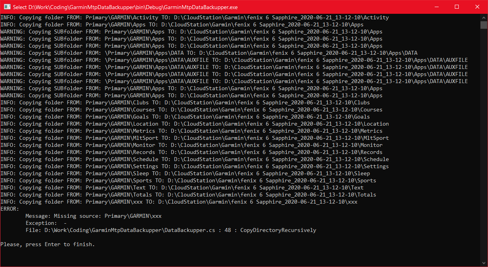

# Garmin Mtp Device Data Backupper
Enables users to backup data from the Garmin device quickly.

TargetPath is the folder where a new one gets created. New folder's name is composition of garminDeviceName and formatted current datetime (e.g. "*fenix 6 Sapphire_2020-06-21_13-12-10*").

### Update config.json
Config example:
```
{
	"garminDiskName": "Primary",
	"garminDeviceName": "fenix 6 Sapphire",
	"garminRoot": "GARMIN",
	"garminFolders": [
		"Activity",
		"Apps",
		....
	],
	"targetPath": "D:\\CloudStation\\Gagmin"
}
```

Where to get **garminDeviceName** value


Where to get **garminDiskName** value


Where to get **garminRoot** value


Where to get **garminFolders** value


### Output example


