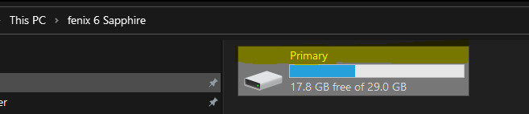

Update config.json
Example:
```
{
	"garminDiskName": "Primary",
	"garminDeviceName": "fenix 6 Sapphire",
	"garminRoot": "GARMIN",
	"garminFolders": [
		"Activity",
		"Apps",
		....
	],
	"targetPath": "D:\\CloudStation\\Gagmin"
}
```


**garminDeviceName**


**garminDiskName**



**garminRoot**


**garminFolders**


